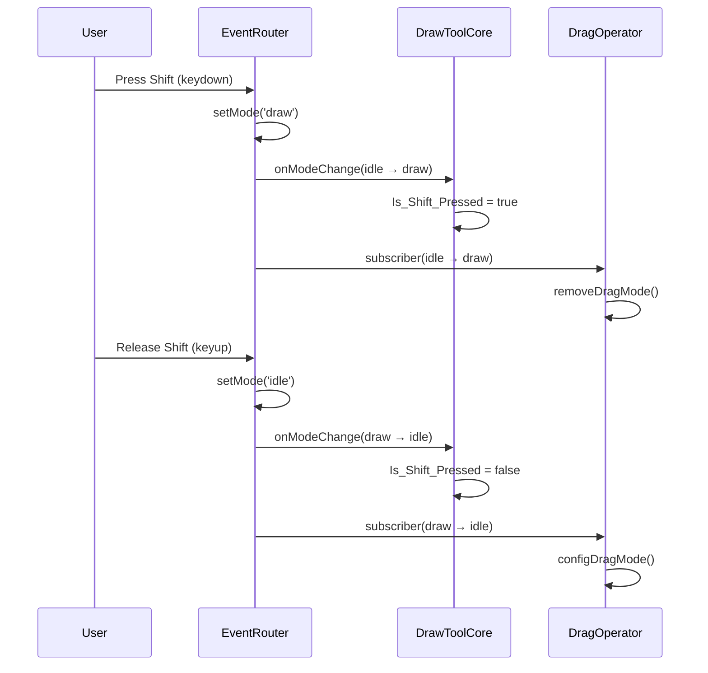

# EventRouter Implementation Walkthrough

## Overview

This document summarizes the EventRouter implementation for the NRRDTools segmentation module. The EventRouter centralizes event handling that was previously scattered across `DrawToolCore.ts` and `DragOperator.ts`.

## Completed Work

### Phase 1: EventRouter Skeleton ✅

Created `segmentation/eventRouter/` directory with:

| File | Purpose |
|------|---------|
| [types.ts](file:///c:/Users/lgao142/Desktop/clinial%20dashboard%20plugin%20work%202025/medical-image-annotator-failed/annotator-frontend/src/ts/Utils/segmentation/eventRouter/types.ts) | Type definitions for `InteractionMode`, handlers, config |
| [EventRouter.ts](file:///c:/Users/lgao142/Desktop/clinial%20dashboard%20plugin%20work%202025/medical-image-annotator-failed/annotator-frontend/src/ts/Utils/segmentation/eventRouter/EventRouter.ts) | Core EventRouter class (~440 lines) |
| [index.ts](file:///c:/Users/lgao142/Desktop/clinial%20dashboard%20plugin%20work%202025/medical-image-annotator-failed/annotator-frontend/src/ts/Utils/segmentation/eventRouter/index.ts) | Barrel export |

render_diffs(file:///c:/Users/lgao142/Desktop/clinial%20dashboard%20plugin%20work%202025/medical-image-annotator-failed/annotator-frontend/src/ts/Utils/segmentation/eventRouter/EventRouter.ts)

---

### Phase 2: DrawToolCore Integration ✅

Modified [DrawToolCore.ts](file:///c:/Users/lgao142/Desktop/clinial%20dashboard%20plugin%20work%202025/medical-image-annotator-failed/annotator-frontend/src/ts/Utils/segmentation/DrawToolCore.ts) to:

1. Import and instantiate `EventRouter` in `initDrawToolCore()`
2. Configure `onModeChange` callback to sync with existing state flags
3. Register keyboard handlers via `setKeydownHandler()` and `setKeyupHandler()`

render_diffs(file:///c:/Users/lgao142/Desktop/clinial%20dashboard%20plugin%20work%202025/medical-image-annotator-failed/annotator-frontend/src/ts/Utils/segmentation/DrawToolCore.ts)

---

### Phase 3: DragOperator Events ✅

Modified [DragOperator.ts](file:///c:/Users/lgao142/Desktop/clinial%20dashboard%20plugin%20work%202025/medical-image-annotator-failed/annotator-frontend/src/ts/Utils/segmentation/DragOperator.ts) to:

1. Add `setEventRouter()` method for EventRouter injection
2. Subscribe to mode changes to control `configDragMode()`/`removeDragMode()`
3. Skip legacy keyboard listeners when EventRouter is available

render_diffs(file:///c:/Users/lgao142/Desktop/clinial%20dashboard%20plugin%20work%202025/medical-image-annotator-failed/annotator-frontend/src/ts/Utils/segmentation/DragOperator.ts)

Modified [NrrdTools.ts](file:///c:/Users/lgao142/Desktop/clinial%20dashboard%20plugin%20work%202025/medical-image-annotator-failed/annotator-frontend/src/ts/Utils/segmentation/NrrdTools.ts) to inject EventRouter into DragOperator.

render_diffs(file:///c:/Users/lgao142/Desktop/clinial%20dashboard%20plugin%20work%202025/medical-image-annotator-failed/annotator-frontend/src/ts/Utils/segmentation/NrrdTools.ts)

---

## How Mode Changes Work

---

## Remaining Work (Phase 4)

Found 19+ `addEventListener` calls in `DrawToolCore.ts` for pointer/wheel events:
- Lines 237, 266, 331, 371, 442, 446, 457, 480, 484, 493, 523, 528, 666, 702, 713, 751, 2095, 2141, 2146

These are dynamically added/removed based on tool state (pencil, brush, eraser, sphere, etc.) and would require significant refactoring to route through EventRouter.

> [!NOTE]
> Phase 4 is optional - the core keyboard event consolidation is complete. Pointer/wheel event migration can be done incrementally as needed.

---

## Build Status

✅ Compilation passes - no new errors from EventRouter integration

Pre-existing errors (unrelated to this work):
- `@types/three` module resolution
- `view-utils/utils-right.ts` property errors
